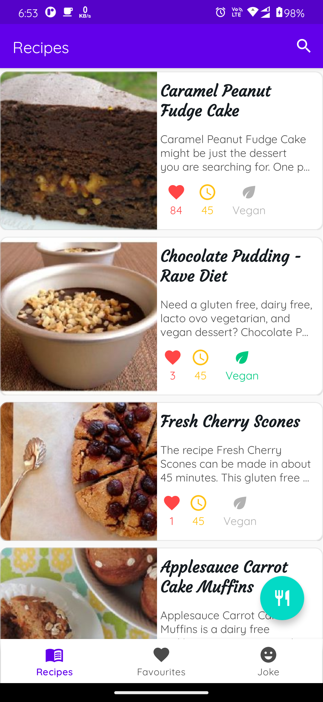
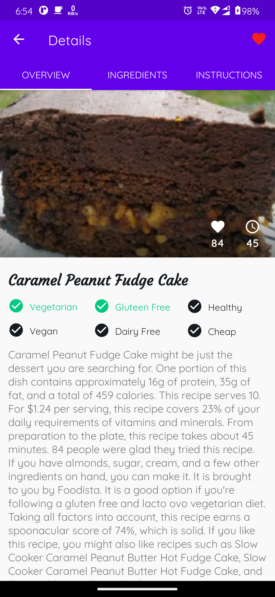
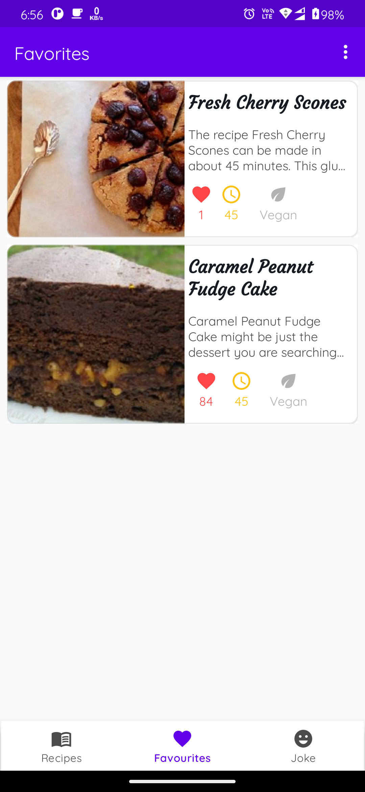
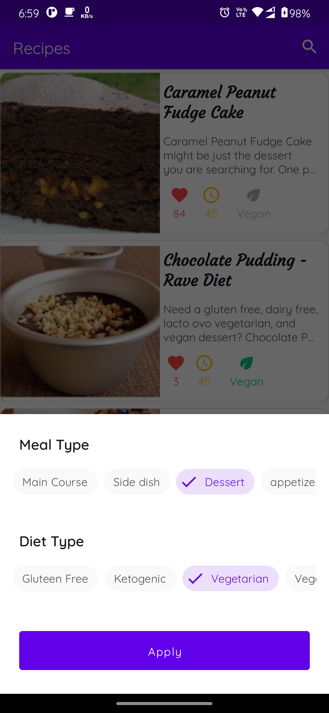
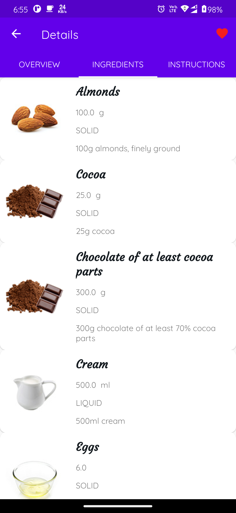
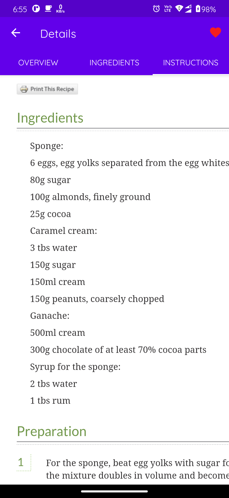
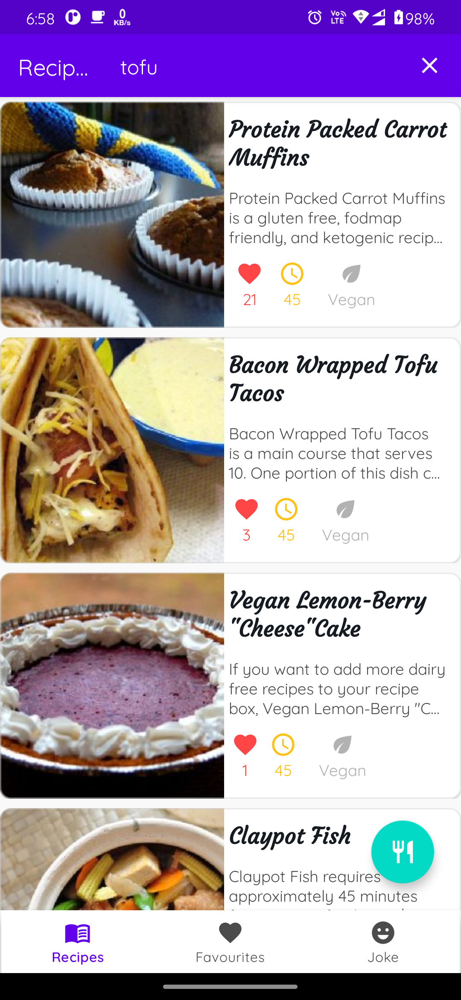
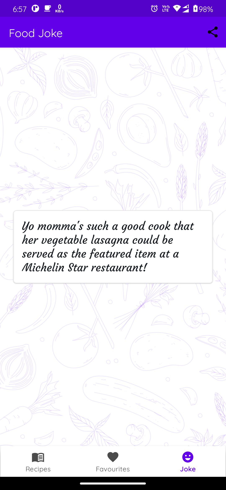

<p align="center">
    
</p>

## Recipe App

Welcome to the Recipe App! This app is designed to help you find and manage recipes with ease.

[](https://play.google.com/store/apps/details?id=com.labs.recipe)

## Upcoming changes
- migration from moshi codegen to kotlinx serialization
- migration from diffutil to Asynclist differ
- migration from livedata to Flow

## Features

- Browse through a wide variety of recipes.
- Save your favorite recipes.
- Dark mode
- Search for recipes by ingredients, name, or cuisine.
- Step-by-step cooking instructions.
- Offline caching(view recipe offline)

## Screenshots
|   Recipes   |   Recipe Detail   |   Favorites   |   Filter   
|--- |--- |--- |--- |
|  |  |  |  | 

|   Ingrediants Details   |   Instruction   |   Search   |   Joke
|--- |--- |--- |---|
| |  |  |  |
## Getting Started

To get started with the Recipe App, follow these steps:

1. Clone the repository:
   ```sh
   git clone https://github.com/Ayush-75/Recipe.git
